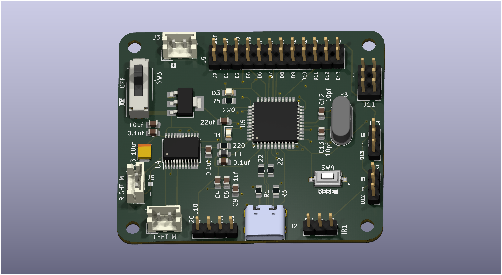

# PCB_v5_Line_Following

## Updates:
- New IC Atemga328pa -> Atemga32u4. Takes D+ and D- from usb no need for usb to uart controller
- Motor connectors moved in one section of the board
- Trace fixed for switch that was keeping motor controller on all the time. Motors will be off when usb c connected only.
- Power conversion only happens in one part of the pcb
- USB C footprint updated to current part we have previosuily ordered. No more issues soldering them.

